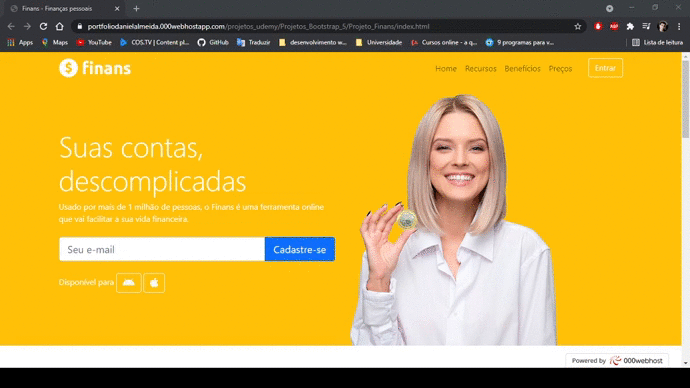

<h1 align="center">
    
    <br>
    Site em um dispositivo grande
</h1>

<h1 align="center">
    
    <br>
    Site em um dispositivo pequeno
</h1>

<h3 align="center">
    <a href="https://portfoliodanielalmeida.000webhostapp.com/projetos_udemy/Projetos_Bootstrap_5/Projeto_Finans/index.html">Acessar demosntração</a>
</h3>

---

## 📋 Sobre
O projeto Finans foi criado dentro do curso Desenvolvimento Web Completo 2021 com o intuito de colocarmos em prática todo o conteudo estudado na seção 7.

---

## 🚀 Tecnologias utilizadas

- [Bootstrap 5](https://getbootstrap.com/docs/5.0/getting-started/introduction/)

- [CSS3](https://www.w3schools.com/css/default.asp)

- [HTML5](https://www.w3schools.com/html/default.asp)

- [JavaScript](https://www.w3schools.com/js/default.asp)

---

## 📁 Como baixar o projeto

```bash

# Clonar o repositório
$ git clone https://github.com/Dani2003G/Projeto-Finans

# Entrar no diretório
$ cd Projeto-finans

# Instalar as dependências
$ yarn install

# Iniciar o projeto
$ yarn start

```
